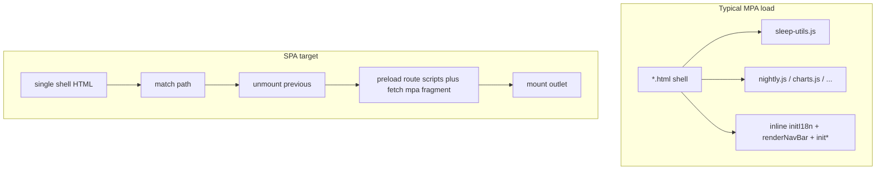

# MPA → SPA (repo-tailored plan)

## Progress

Summary: **All YAML todos completed** through **Phase 9b** (legacy redirects + `dist/mpa/` fragment copies). Canonical ADRs: [decisions.md](c:/Users/UriasRey/Desktop/sleep_proj/docs/migration/decisions.md). **Next (backlog, not in YAML):** optional fragment bundling (`import()` per route), slim or remove root MPA shells from source when traffic confirms.

| Todo | Status | Notes |
|------|--------|--------|
| `docs-track` | **Completed** | [docs/migration/](c:/Users/UriasRey/Desktop/sleep_proj/docs/migration/) |
| `utils-audit` | **Completed** | [listener-audit.md](c:/Users/UriasRey/Desktop/sleep_proj/docs/migration/listener-audit.md); [utils_audit_gate.plan.md](c:/Users/UriasRey/Desktop/sleep_proj/.cursor/plans/utils_audit_gate.plan.md) |
| `first-lifecycle` | **Completed** | [quality.js](c:/Users/UriasRey/Desktop/sleep_proj/quality.js), [lifecycle-contract.md](c:/Users/UriasRey/Desktop/sleep_proj/docs/migration/lifecycle-contract.md) |
| `route-table` | **Completed** | [routes-data.mjs](c:/Users/UriasRey/Desktop/sleep_proj/routes-data.mjs) + [route-table.md](c:/Users/UriasRey/Desktop/sleep_proj/docs/migration/route-table.md) |
| `data-fetching-policy` | **Completed** | [decisions.md](c:/Users/UriasRey/Desktop/sleep_proj/docs/migration/decisions.md) |
| `rollout-lifecycles` | **Completed** | dashboard → charts → nightly → log → stats |
| `settings-about-extraction` | **Completed** | [about.js](c:/Users/UriasRey/Desktop/sleep_proj/about.js), [settings.js](c:/Users/UriasRey/Desktop/sleep_proj/settings.js) |
| `sleep-data-store-phase-6-5` | **Completed** | `__restoreSleepDataStore` |
| `link-helper` | **Completed** | `mpaHref` / registry in `routes-data.mjs` |
| `module-migration` | **Completed** | ESM shells + `*-boot.js` |
| `bundler-optional` | **Completed** | [vite.config.js](c:/Users/UriasRey/Desktop/sleep_proj/vite.config.js), [package.json](c:/Users/UriasRey/Desktop/sleep_proj/package.json) |
| `pivot` | **Completed** | [index.html](c:/Users/UriasRey/Desktop/sleep_proj/index.html) + [src/spa-app.js](c:/Users/UriasRey/Desktop/sleep_proj/src/spa-app.js) + [vercel.json](c:/Users/UriasRey/Desktop/sleep_proj/vercel.json) rewrites |
| `phase-9b-redirects` | **Completed** | Root `*.html` → path **redirects**; shells in **`dist/mpa/`** for SPA `fetch`; [decisions.md — Phase 9b](c:/Users/UriasRey/Desktop/sleep_proj/docs/migration/decisions.md) |

## Phase 4 — Route table + data-fetching policy (complete)

**Shipped:** [routes-data.mjs](c:/Users/UriasRey/Desktop/sleep_proj/routes-data.mjs) (`__restoreRoutesData`) before `sleep-utils.js` on MPA shells (and imported before `sleep-utils` in the SPA entry); `renderNavBar` consumes it. Accepted ADR in [decisions.md](c:/Users/UriasRey/Desktop/sleep_proj/docs/migration/decisions.md): single sleep-data store (boot / first read), `loadSleepData({ forceRefresh: true })` for explicit refresh + post-mutation invalidation, route subscribe/unmount, refresh triggers (boot, mutation, cloud sync done, visibility, 12h `lastFetchedAt`), midnight re-derive as per-route render concern; Phase 5 store = one file, module-shaped singleton on `window` until Vite.

## Phase 5 — Rollout lifecycles (complete)

**Shipped:** `mount` / `unmount` rollout for tab routes in pattern-first order after quality proof:

- dashboard → charts → nightly timeline → log → stats
- harness logs on each route (`?lifecycleHarness=1`) for mount → unmount → mount verification

## Phase 6 — Settings/About extraction (complete)

**Shipped:** moved inline init from menu routes into dedicated modules and lifecycle globals:

- [`about.js`](c:/Users/UriasRey/Desktop/sleep_proj/about.js) + `window.__restoreAboutLifecycle`
- [`settings.js`](c:/Users/UriasRey/Desktop/sleep_proj/settings.js) + `window.__restoreSettingsLifecycle`
- updated script chains in [`docs/migration/route-table.md`](c:/Users/UriasRey/Desktop/sleep_proj/docs/migration/route-table.md) and contract in [`docs/migration/lifecycle-contract.md`](c:/Users/UriasRey/Desktop/sleep_proj/docs/migration/lifecycle-contract.md)

## Phase 6.5 — Sleep-data store (complete)

Implemented the accepted ADR in [`docs/migration/decisions.md`](c:/Users/UriasRey/Desktop/sleep_proj/docs/migration/decisions.md):

- one store module-shaped singleton (`window.__restoreSleepDataStore`, pre-Vite window-attached)
- subscribe/unsubscribe model for route lifecycles
- `lastFetchedAt` 12h revalidation and `forceRefresh` invalidation paths
- compatibility wrapper: `loadSleepData(...)` routes through the store

## What exists today (post Phase 9b)

- **Bundler:** [package.json](c:/Users/UriasRey/Desktop/sleep_proj/package.json) — `dev` / `build` / `preview` (Vite); `test:math` unchanged.
- **SPA (primary):** [index.html](c:/Users/UriasRey/Desktop/sleep_proj/index.html) + [src/spa-app.js](c:/Users/UriasRey/Desktop/sleep_proj/src/spa-app.js) — path routes, `fetch` of **`/mpa/*.html`** in production for outlet markup, classic script preloads per route, shared `#tooltip` / `#day-panel` in shell.
- **MPA (source):** Per-page `*.html` remain in-repo for direct open / dev; **`npm run build`** copies shells to **`dist/mpa/`** only (not site root). [vercel.json](c:/Users/UriasRey/Desktop/sleep_proj/vercel.json) **redirects** root `*.html` bookmarks to path URLs, then SPA **rewrites**.
- **Shared core:** `dev-git-branch.js` → `local-supabase-presets.js` → [routes-data.mjs](c:/Users/UriasRey/Desktop/sleep_proj/routes-data.mjs) → [sleep-utils.js](c:/Users/UriasRey/Desktop/sleep_proj/sleep-utils.js); route scripts as today. **`nightly.js`** on dashboard, log, quality, nightly only; **charts** = [charts.js](c:/Users/UriasRey/Desktop/sleep_proj/charts.js); **stats** = `stats-aggregates.js` + [stats.js](c:/Users/UriasRey/Desktop/sleep_proj/stats.js).
- **Nav source of truth:** [routes-data.mjs](c:/Users/UriasRey/Desktop/sleep_proj/routes-data.mjs) (`navTabs`, `href`, `spaHref`, `internalNavHref`); [route-table.md](c:/Users/UriasRey/Desktop/sleep_proj/docs/migration/route-table.md).
- **Lifecycle:** `*-boot.js` for MPA; SPA central boot in `spa-app.js` with same `mount`/`unmount` globals.

## Listener / lifecycle reality check (adjusts the draft)

Rough `addEventListener` counts in `.js` (ripgrep; re-run before audits): **sleep-utils ~73**, **charts.js ~38**, **nightly.js ~32** (includes `document` listeners inside feature flows such as deviation flags / target sliders), **dashboard.js ~14**, **entry-modal.js ~6**, **stats.js / quick-actions.js ~1** each.

Corrections vs older draft wording:

- **Heavy axis:** **Charts + shared `sleep-utils` + `nightly.js` (when those flows run)**. [log.js](c:/Users/UriasRey/Desktop/sleep_proj/log.js) has **no direct** `addEventListener` but still owns a **`setInterval`** for remaining-wake updates and delegates to quick-add / modal code in `sleep-utils` — unmount must clear timers and any modal wiring even when listener count is low.
- **`sleep-utils.js`** is **~4.5k lines** — still the correct **gating audit**; scope the audit doc to **listeners + timers + one-off global state** that survives route changes.

## Documentation track (align with existing docs)

You already maintain feature docs under [docs/](c:/Users/UriasRey/Desktop/sleep_proj/docs) (`dev-banner`, `quick-actions`, `user-data-cloud`, `semantic-keyword-palette`). Add a **`docs/migration/`** working set as in the draft (`conventions`, `listener-audit`, `lifecycle-contract`, `route-table`, `decisions`). **When migration touches nav, dev banner, quick actions, or cloud settings**, update the corresponding existing doc per [.cursor/rules](c:/Users/UriasRey/Desktop/sleep_proj/.cursor/rules) — migration notes should **link** to those canonical docs rather than duplicating behavior specs.

## Workstreams (order and repo-specific notes)

1. **Living migration docs** — Create `docs/migration/` files early; update as each step lands.

2. **`sleep-utils.js` listener / singleton audit (gate)** — Classify each registration (and related timers) as **per-route**, **app-singleton**, or **per-element / torn down with subtree**. Outcome decides incremental vs **Vite fork** if entanglement is prohibitive.

3. **First `mount` / `unmount` + dev harness (freeze the contract here)** — Use **only** a route that already has a **dedicated page script** and a **single obvious DOM outlet** so the proof isolates lifecycle shape from refactoring noise:
   - **Recommended: [quality.js](c:/Users/UriasRey/Desktop/sleep_proj/quality.js) or [stats.js](c:/Users/UriasRey/Desktop/sleep_proj/stats.js).** Both give fast signal on `mount`/`unmount`, promises/async teardown, and outlet clearing at low risk. Pick one; the other becomes an early rollout step once the contract is written down.
   - **Do not use settings/about as the first conversion.** Those pages prove **inline-init extraction** and lifecycle at the same time—more variables, slower to interpret failures, and the extraction pattern should be **informed by** the frozen contract, not co-defining it.
   - Harness: query param or dev-only key to run **mount → unmount → mount** on the same outlet (MPA never calls `unmount` naturally). Capture the resulting API in `lifecycle-contract.md`.

4. **Data-fetching policy** — Decide per route: e.g. quality/stats refetch on mount vs session cache; log/nightly “fresh after edit” expectations. Record in `decisions.md` (ties to `loadSleepData` / Supabase hydration patterns documented in [docs/user-data-cloud.md](c:/Users/UriasRey/Desktop/sleep_proj/docs/user-data-cloud.md)).

5. **Canonical route table** — Extract from `renderNavBar`’s `pages` array **plus** menu-only and index routes. Suggested fields: `id`, `mpaPath` (`dashboard.html`), `spaPath` (e.g. `/dashboard`), `navKind` (`tab` | `menu` | `redirect`), `pageScriptChain` or `entryModule` (informed by step 3). Keep **`timeline` ↔ `nightly.html`** nav id ↔ file explicit in [route-table.md](c:/Users/UriasRey/Desktop/sleep_proj/docs/migration/route-table.md).

6. **Roll out lifecycles (explicit default order + tradeoff)** — Two defensible strategies:
   - **Risk-first:** charts → nightly → dashboard → … — stress-tests the contract early when gaps are cheapest to fix in the abstract, but hits the **highest listener / shared-lib complexity** before the team has repeated the mount pattern across routes.
   - **Pattern-first (chosen default for this plan):** **First proof (quality *or* stats)** → **second proof: [dashboard](c:/Users/UriasRey/Desktop/sleep_proj/dashboard.js)** (exercises **`nightly.js` coupling**, quick-actions, and tooltip/day-panel neighbors **without** charts’ listener volume) → **charts** → **nightly** → **log** → **the sibling of stats/quality** not used as first proof → **settings/about** (only after the dedicated extraction step). Rationale: build muscle memory and validate the contract against medium complexity before charts/nightly; accept slightly later discovery of charts-only contract edge cases, when fixes are still localized.
   - **Record in `decisions.md`:** the chosen order, the alternative you rejected, and any mid-rollout change (e.g. if dashboard second-proof surfaces a contract flaw that forces an earlier charts spike).

6b. **Settings/about inline-init extraction (later)** — Move large inline `<script>` blocks from [settings.html](c:/Users/UriasRey/Desktop/sleep_proj/settings.html) / [about.html](c:/Users/UriasRey/Desktop/sleep_proj/about.html) into dedicated modules **after** `lifecycle-contract.md` is stable, **then** implement `mount`/`unmount` for those routes. This is intentionally **not** merged with workstream 3.

7. **Link helper** — Centralize internal `href` generation for MPA now; later swap to router `pushState` + click interception (preserve modifier-click / middle-click new tab). Hash targets already matter (`settings.html#cloud-sync`, `about.html#…`, `stats.html` → `about.html#sleep-statistics`); document one strategy (hash vs path) in `decisions.md`.

8. **ES modules (optional prep)** — Move toward `type="module"` entry per route with a **shrink-only** `window.*` compat rule as in the draft.

9. **Bundler** — **Done:** Vite + static copy ([vite.config.js](c:/Users/UriasRey/Desktop/sleep_proj/vite.config.js)).

10. **Pivot + 9b** — **Done:** SPA shell, History + click interception, [vercel.json](c:/Users/UriasRey/Desktop/sleep_proj/vercel.json) redirects + rewrites, `dist/mpa/` fragment copies (see [decisions.md](c:/Users/UriasRey/Desktop/sleep_proj/docs/migration/decisions.md) Phases 9–9b).

## Incremental vs hard fork (unchanged criterion)

Start incremental in-tree; **if the `sleep-utils` audit shows unfixable mixing of singleton vs per-route behavior**, pivot the plan to a clean **Vite app folder** and port screens with the same route table and lifecycle contract.
