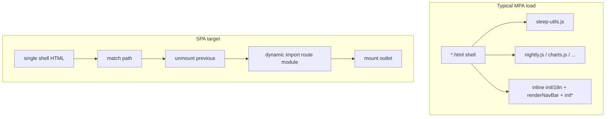

# MPA → SPA (repo-tailored plan)

## Progress

Summary: **5 / 11** todos completed (through **Phase 4**). **Next:** Phase 5 — `rollout-lifecycles`.

| Todo | Status | Notes |
|------|--------|--------|
| `docs-track` | **Completed** | [docs/migration/conventions.md](c:/Users/UriasRey/Desktop/sleep_proj/docs/migration/conventions.md) + sibling stubs |
| `utils-audit` | **Completed** | [docs/migration/listener-audit.md](c:/Users/UriasRey/Desktop/sleep_proj/docs/migration/listener-audit.md); gate plan: [utils_audit_gate.plan.md](c:/Users/UriasRey/Desktop/sleep_proj/.cursor/plans/utils_audit_gate.plan.md) |
| `first-lifecycle` | **Completed** | [lifecycle-contract.md](c:/Users/UriasRey/Desktop/sleep_proj/docs/migration/lifecycle-contract.md); impl: [quality.js](c:/Users/UriasRey/Desktop/sleep_proj/quality.js), [quality.html](c:/Users/UriasRey/Desktop/sleep_proj/quality.html); plan: [first_lifecycle_contract.plan.md](c:/Users/UriasRey/Desktop/sleep_proj/.cursor/plans/first_lifecycle_contract.plan.md) |
| `route-table` | **Completed** | [routes-data.js](c:/Users/UriasRey/Desktop/sleep_proj/routes-data.js) + [route-table.md](c:/Users/UriasRey/Desktop/sleep_proj/docs/migration/route-table.md) |
| `data-fetching-policy` | **Completed** | [decisions.md — Data fetching](c:/Users/UriasRey/Desktop/sleep_proj/docs/migration/decisions.md) (accepted ADR: single store, subscribe/unmount, refresh rules, midnight render note, Phase 5 module shape) |
| `rollout-lifecycles` | **Next** | Phase 5 |
| `settings-about-extraction` | Pending | |
| `link-helper` | Pending | |
| `module-migration` | Pending | |
| `bundler-optional` | Pending | |
| `pivot` | Pending | |

## Phase 4 — Route table + data-fetching policy (complete)

**Shipped:** [routes-data.js](c:/Users/UriasRey/Desktop/sleep_proj/routes-data.js) (`__restoreRoutesData`) before `sleep-utils.js` on all shells; `renderNavBar` consumes it. Accepted ADR in [decisions.md](c:/Users/UriasRey/Desktop/sleep_proj/docs/migration/decisions.md): single sleep-data store (boot / first read), `loadSleepData({ forceRefresh: true })` for explicit refresh + post-mutation invalidation, route subscribe/unmount, refresh triggers (boot, mutation, cloud sync done, visibility, 12h `lastFetchedAt`), midnight re-derive as per-route render concern; Phase 5 store = one file, module-shaped singleton on `window` until Vite.

**Phase 5 (current):** `rollout-lifecycles` (dashboard second proof → charts → nightly → log → stats → settings/about after extraction).

## What exists today

- **No bundler**: [package.json](c:/Users/UriasRey/Desktop/sleep_proj/package.json) only defines `test:math`; pages load classic `<script src="…">` chains per HTML file.
- **Nine shells**: Tab routes — `dashboard`, `log`, `quality`, **`timeline` → [nightly.html](c:/Users/UriasRey/Desktop/sleep_proj/nightly.html)** (nav label “Nightly”), **`charts` → [charts.html](c:/Users/UriasRey/Desktop/sleep_proj/charts.html)**, `stats`. Menu-only — [about.html](c:/Users/UriasRey/Desktop/sleep_proj/about.html), [settings.html](c:/Users/UriasRey/Desktop/sleep_proj/settings.html) (hamburger uses `settings.html#cloud-sync` for cloud). Plus [index.html](c:/Users/UriasRey/Desktop/sleep_proj/index.html) **meta-refreshes to `dashboard.html`** (SPA cutover must replace this with a real shell or redirect policy).
- **Shared core**: Every substantive page loads `dev-git-branch.js` → `local-supabase-presets.js` → [routes-data.js](c:/Users/UriasRey/Desktop/sleep_proj/routes-data.js) → [sleep-utils.js](c:/Users/UriasRey/Desktop/sleep_proj/sleep-utils.js). **`nightly.js`** is included on **dashboard, log, quality, nightly** but **not** on charts/stats/settings/about — any SPA module graph must respect that split until bundles unify. **Charts** loads [charts.js](c:/Users/UriasRey/Desktop/sleep_proj/charts.js) only; **stats** loads `stats-aggregates.js` + [stats.js](c:/Users/UriasRey/Desktop/sleep_proj/stats.js).
- **Nav source of truth**: [routes-data.js](c:/Users/UriasRey/Desktop/sleep_proj/routes-data.js) (`__restoreRoutesData.navTabs` + `href`); [sleep-utils.js](c:/Users/UriasRey/Desktop/sleep_proj/sleep-utils.js) `renderNavBar` maps them to HTML. Human table + script matrix: [route-table.md](c:/Users/UriasRey/Desktop/sleep_proj/docs/migration/route-table.md).
- **Per-page shells**: Typical init is inline `async function init…Page()` after scripts: `initI18n` → `renderNavBar('<id>')` → `initDayNightTheme` → `initRemainingWakeNav` (sometimes `{ interval: false }`). **Settings/about** use **inline-only** boot logic (no dedicated `settings.js` / `about.js`) — **not** the first lifecycle contract target; extract them **after** the contract is frozen (dedicated workstream below).
- **Global UI nodes**: e.g. [dashboard.html](c:/Users/UriasRey/Desktop/sleep_proj/dashboard.html) includes `#tooltip` and `#day-panel`; [charts.html](c:/Users/UriasRey/Desktop/sleep_proj/charts.html) does too. SPA shell design must decide what lives **once in the shell** vs **per-route**.

## Listener / lifecycle reality check (adjusts the draft)

Rough `addEventListener` counts in `.js` (ripgrep; re-run before audits): **sleep-utils ~73**, **charts.js ~38**, **nightly.js ~32** (includes `document` listeners inside feature flows such as deviation flags / target sliders), **dashboard.js ~14**, **entry-modal.js ~6**, **stats.js / quick-actions.js ~1** each.

Corrections vs older draft wording:

- **Heavy axis:** **Charts + shared `sleep-utils` + `nightly.js` (when those flows run)**. [log.js](c:/Users/UriasRey/Desktop/sleep_proj/log.js) has **no direct** `addEventListener` but still owns a **`setInterval`** for remaining-wake updates and delegates to quick-add / modal code in `sleep-utils` — unmount must clear timers and any modal wiring even when listener count is low.
- **`sleep-utils.js`** is **~4.5k lines** — still the correct **gating audit**; scope the audit doc to **listeners + timers + one-off global state** that survives route changes.

## Documentation track (align with existing docs)

You already maintain feature docs under [docs/](c:/Users/UriasRey/Desktop/sleep_proj/docs) (`dev-banner`, `quick-actions`, `user-data-cloud`, `semantic-keyword-palette`). Add a **`docs/migration/`** working set as in the draft (`conventions`, `listener-audit`, `lifecycle-contract`, `route-table`, `decisions`). **When migration touches nav, dev banner, quick actions, or cloud settings**, update the corresponding existing doc per [.cursor/rules](c:/Users/UriasRey/Desktop/sleep_proj/.cursor/rules) — migration notes should **link** to those canonical docs rather than duplicating behavior specs.

## Workstreams (order and repo-specific notes)

1. **Living migration docs** — Create `docs/migration/` files early; update as each step lands.

2. **`sleep-utils.js` listener / singleton audit (gate)** — Classify each registration (and related timers) as **per-route**, **app-singleton**, or **per-element / torn down with subtree**. Outcome decides incremental vs **Vite fork** if entanglement is prohibitive.

3. **First `mount` / `unmount` + dev harness (freeze the contract here)** — Use **only** a route that already has a **dedicated page script** and a **single obvious DOM outlet** so the proof isolates lifecycle shape from refactoring noise:
   - **Recommended: [quality.js](c:/Users/UriasRey/Desktop/sleep_proj/quality.js) or [stats.js](c:/Users/UriasRey/Desktop/sleep_proj/stats.js).** Both give fast signal on `mount`/`unmount`, promises/async teardown, and outlet clearing at low risk. Pick one; the other becomes an early rollout step once the contract is written down.
   - **Do not use settings/about as the first conversion.** Those pages prove **inline-init extraction** and lifecycle at the same time—more variables, slower to interpret failures, and the extraction pattern should be **informed by** the frozen contract, not co-defining it.
   - Harness: query param or dev-only key to run **mount → unmount → mount** on the same outlet (MPA never calls `unmount` naturally). Capture the resulting API in `lifecycle-contract.md`.

4. **Data-fetching policy** — Decide per route: e.g. quality/stats refetch on mount vs session cache; log/nightly “fresh after edit” expectations. Record in `decisions.md` (ties to `loadSleepData` / Supabase hydration patterns documented in [docs/user-data-cloud.md](c:/Users/UriasRey/Desktop/sleep_proj/docs/user-data-cloud.md)).

5. **Canonical route table** — Extract from `renderNavBar`’s `pages` array **plus** menu-only and index routes. Suggested fields: `id`, `mpaPath` (`dashboard.html`), `spaPath` (e.g. `/dashboard`), `navKind` (`tab` | `menu` | `redirect`), `pageScriptChain` or `entryModule` (informed by step 3). Keep **`timeline` ↔ `nightly.html`** nav id ↔ file explicit in [route-table.md](c:/Users/UriasRey/Desktop/sleep_proj/docs/migration/route-table.md).

6. **Roll out lifecycles (explicit default order + tradeoff)** — Two defensible strategies:
   - **Risk-first:** charts → nightly → dashboard → … — stress-tests the contract early when gaps are cheapest to fix in the abstract, but hits the **highest listener / shared-lib complexity** before the team has repeated the mount pattern across routes.
   - **Pattern-first (chosen default for this plan):** **First proof (quality *or* stats)** → **second proof: [dashboard](c:/Users/UriasRey/Desktop/sleep_proj/dashboard.js)** (exercises **`nightly.js` coupling**, quick-actions, and tooltip/day-panel neighbors **without** charts’ listener volume) → **charts** → **nightly** → **log** → **the sibling of stats/quality** not used as first proof → **settings/about** (only after the dedicated extraction step). Rationale: build muscle memory and validate the contract against medium complexity before charts/nightly; accept slightly later discovery of charts-only contract edge cases, when fixes are still localized.
   - **Record in `decisions.md`:** the chosen order, the alternative you rejected, and any mid-rollout change (e.g. if dashboard second-proof surfaces a contract flaw that forces an earlier charts spike).

6b. **Settings/about inline-init extraction (later)** — Move large inline `<script>` blocks from [settings.html](c:/Users/UriasRey/Desktop/sleep_proj/settings.html) / [about.html](c:/Users/UriasRey/Desktop/sleep_proj/about.html) into dedicated modules **after** `lifecycle-contract.md` is stable, **then** implement `mount`/`unmount` for those routes. This is intentionally **not** merged with workstream 3.

7. **Link helper** — Centralize internal `href` generation for MPA now; later swap to router `pushState` + click interception (preserve modifier-click / middle-click new tab). Hash targets already matter (`settings.html#cloud-sync`, `about.html#…`, `stats.html` → `about.html#sleep-statistics`); document one strategy (hash vs path) in `decisions.md`.

8. **ES modules (optional prep)** — Move toward `type="module"` entry per route with a **shrink-only** `window.*` compat rule as in the draft.

9. **Bundler (optional)** — Add Vite when module graph / `import()` splitting justifies it; can dogfood SPA shell on a branch while production stays MPA.

10. **Pivot** — Single shell (`index.html` or new `app.html`), History API, dynamic `import()` per route, host **rewrite / 404 fallback** (no `netlify.toml` / `vercel.json` in repo today — add when you pick host). Replace root meta-refresh with intentional routing. Optional `.html` → path redirects for bookmarks.

## Incremental vs hard fork (unchanged criterion)

Start incremental in-tree; **if the `sleep-utils` audit shows unfixable mixing of singleton vs per-route behavior**, pivot the plan to a clean **Vite app folder** and port screens with the same route table and lifecycle contract.
