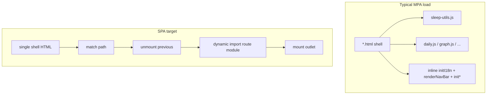

# MPA → SPA (repo-tailored plan)

## What exists today

- **No bundler**: [package.json](c:/Users/UriasRey/Desktop/sleep_proj/package.json) only defines `test:math`; pages load classic `<script src="…">` chains per HTML file.
- **Nine pages**: `dashboard`, `log`, `quality`, `daily` (nav id `timeline`), `graph`, `stats`, `config`, `about`, plus [index.html](c:/Users/UriasRey/Desktop/sleep_proj/index.html) which **meta-refreshes to `dashboard.html`** (SPA cutover must replace this with a real shell or redirect policy).
- **Shared core**: Every substantive page loads `dev-git-branch.js` → `local-supabase-presets.js` → [sleep-utils.js](c:/Users/UriasRey/Desktop/sleep_proj/sleep-utils.js). **Important split**: [daily.js](c:/Users/UriasRey/Desktop/sleep_proj/daily.js) is included on **dashboard, log, quality, and daily** but **not** on graph/stats/config/about — any SPA module graph must respect that split until you unify bundles.
- **Nav source of truth (partial)**: `renderNavBar` embeds a `pages` array (ids, i18n keys, **`*.html` URLs**); hamburger links hard-code `about.html`, `config.html`, `config.html#cloud-sync` in the same function ([sleep-utils.js](c:/Users/UriasRey/Desktop/sleep_proj/sleep-utils.js) around the `pages` definition). **Full route table** must also cover `about`, `config`, and `index` behavior — not only the six tabs.
- **Per-page shells**: Typical init is inline `async function init…Page()` after scripts: `initI18n` → `renderNavBar('<id>')` → `initDayNightTheme` → `initRemainingWakeNav` (sometimes `{ interval: false }`). **Config/about** add multiple `init*` calls and **inline-only** boot logic (no dedicated `config.js` / `about.js`) — **not** the place to define the first lifecycle contract; extract them into modules **after** the contract is frozen (dedicated workstream below).
- **Global UI nodes**: e.g. [dashboard.html](c:/Users/UriasRey/Desktop/sleep_proj/dashboard.html) includes `#tooltip` and `#day-panel`; [graph.html](c:/Users/UriasRey/Desktop/sleep_proj/graph.html) does too. SPA shell design must decide what lives **once in the shell** vs **per-route**.

## Listener / lifecycle reality check (adjusts the draft)

Rough `addEventListener` counts in `.js` (ripgrep): **sleep-utils ~57**, **graph.js ~35**, **daily.js ~19** (includes `document` listeners inside feature flows such as deviation flags / target sliders), **dashboard.js ~13**, **entry-modal.js ~4**, **stats.js / quick-actions.js ~1** each.

Corrections vs the draft wording:

- **“Log/graph most listener-heavy”** — **Graph + shared `sleep-utils` + `daily.js` (when those flows run)** are the heavy axis. [log.js](c:/Users/UriasRey/Desktop/sleep_proj/log.js) has **no direct** `addEventListener` but still owns a **`setInterval`** for remaining-wake updates and delegates to quick-add / modal code in `sleep-utils` — unmount must clear timers and any modal wiring even when listener count is low.
- **`sleep-utils.js`** is about **~4.5k lines** with **~57** `addEventListener` hits — still the correct **gating audit**, but scope the audit doc to **listeners + timers + one-off global state** that survives route changes.

## Documentation track (align with existing docs)

You already maintain feature docs under [docs/](c:/Users/UriasRey/Desktop/sleep_proj/docs) (`dev-banner`, `quick-actions`, `user-data-cloud`, `semantic-keyword-palette`). Add a **`docs/migration/`** working set as in the draft (`conventions`, `listener-audit`, `lifecycle-contract`, `route-table`, `decisions`). **When migration touches nav, dev banner, quick actions, or cloud settings**, update the corresponding existing doc per [.cursor/rules](c:/Users/UriasRey/Desktop/sleep_proj/.cursor/rules) — migration notes should **link** to those canonical docs rather than duplicating behavior specs.

## Workstreams (order and repo-specific notes)

1. **Living migration docs** — Create `docs/migration/` files early; update as each step lands.

2. **`sleep-utils.js` listener / singleton audit (gate)** — Classify each registration (and related timers) as **per-route**, **app-singleton**, or **per-element / torn down with subtree**. Outcome decides incremental vs **Vite fork** if entanglement is prohibitive.

3. **First `mount` / `unmount` + dev harness (freeze the contract here)** — Use **only** a route that already has a **dedicated page script** and a **single obvious DOM outlet** so the proof isolates lifecycle shape from refactoring noise:
   - **Recommended: [quality.js](c:/Users/UriasRey/Desktop/sleep_proj/quality.js) or [stats.js](c:/Users/UriasRey/Desktop/sleep_proj/stats.js).** Both give fast signal on `mount`/`unmount`, promises/async teardown, and outlet clearing at low risk. Pick one; the other becomes an early rollout step once the contract is written down.
   - **Do not use config/about as the first conversion.** Those pages prove **inline-init extraction** and lifecycle at the same time—more variables, slower to interpret failures, and the extraction pattern should be **informed by** the frozen contract, not co-defining it.
   - Harness: query param or dev-only key to run **mount → unmount → mount** on the same outlet (MPA never calls `unmount` naturally). Capture the resulting API in `lifecycle-contract.md`.

4. **Data-fetching policy** — Decide per route: e.g. quality/stats refetch on mount vs session cache; log/daily “fresh after edit” expectations. Record in `decisions.md` (ties to `loadSleepData` / Supabase hydration patterns documented in [docs/user-data-cloud.md](c:/Users/UriasRey/Desktop/sleep_proj/docs/user-data-cloud.md)).

5. **Canonical route table** — Extract from `renderNavBar`’s `pages` array **plus** menu-only and index routes. Suggested fields: `id`, `mpaPath` (`dashboard.html`), `spaPath` (e.g. `/dashboard`), `navKind` (`tab` | `menu` | `redirect`), `pageScriptChain` or `entryModule` (informed by step 3). Keep **`timeline` ↔ `daily.html`** id mismatch explicit in the table.

6. **Roll out lifecycles (explicit default order + tradeoff)** — Two defensible strategies:
   - **Risk-first:** graph → daily → dashboard → … — stress-tests the contract early when gaps are cheapest to fix in the abstract, but hits the **highest listener / shared-lib complexity** before the team has repeated the mount pattern across routes.
   - **Pattern-first (chosen default for this plan):** **First proof (quality *or* stats)** → **second proof: [dashboard](c:/Users/UriasRey/Desktop/sleep_proj/dashboard.js)** (exercises **`daily.js` coupling**, quick-actions, and tooltip/day-panel neighbors **without** graph’s listener volume) → **graph** → **daily** → **log** → **the sibling of stats/quality** not used as first proof → **config/about** (only after the dedicated extraction step). Rationale: build muscle memory and validate the contract against medium complexity before graph/daily; accept slightly later discovery of graph-only contract edge cases, when fixes are still localized.
   - **Record in `decisions.md`:** the chosen order, the alternative you rejected, and any mid-rollout change (e.g. if dashboard second-proof surfaces a contract flaw that forces an earlier graph spike).

6b. **Config/about inline-init extraction (later)** — Move large inline `<script>` blocks from [config.html](c:/Users/UriasRey/Desktop/sleep_proj/config.html) / [about.html](c:/Users/UriasRey/Desktop/sleep_proj/about.html) into dedicated modules **after** `lifecycle-contract.md` is stable, **then** implement `mount`/`unmount` for those routes. This is intentionally **not** merged with workstream 3.

7. **Link helper** — Centralize internal `href` generation for MPA now; later swap to router `pushState` + click interception (preserve modifier-click / middle-click new tab). Hash targets already matter (`config.html#cloud-sync`, `about.html#…`, `stats.html` → `about.html#sleep-statistics`); document one strategy (hash vs path) in `decisions.md`.

8. **ES modules (optional prep)** — Move toward `type="module"` entry per route with a **shrink-only** `window.*` compat rule as in the draft.

9. **Bundler (optional)** — Add Vite when module graph / `import()` splitting justifies it; can dogfood SPA shell on a branch while production stays MPA.

10. **Pivot** — Single shell (`index.html` or new `app.html`), History API, dynamic `import()` per route, host **rewrite / 404 fallback** (no `netlify.toml` / `vercel.json` in repo today — add when you pick host). Replace root meta-refresh with intentional routing. Optional `.html` → path redirects for bookmarks.

## Incremental vs hard fork (unchanged criterion)

Start incremental in-tree; **if the `sleep-utils` audit shows unfixable mixing of singleton vs per-route behavior**, pivot the plan to a clean **Vite app folder** and port screens with the same route table and lifecycle contract.
