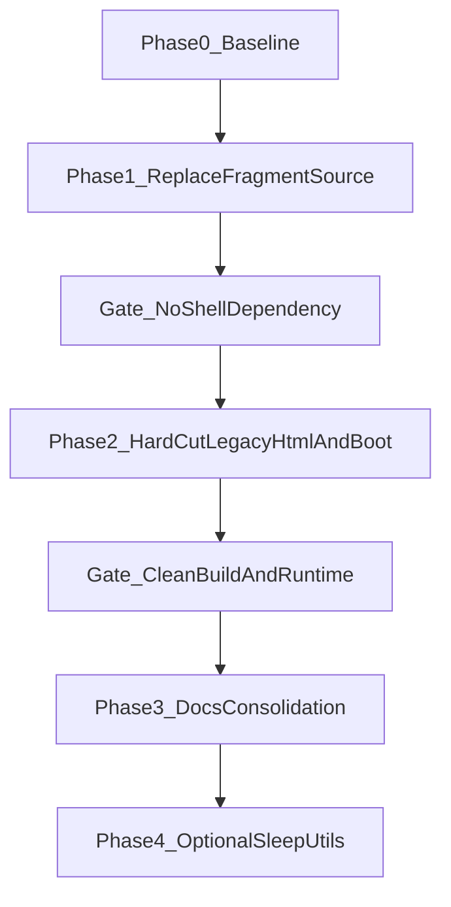

# Post-Migration Cleanup Plan

## Goals
- Remove legacy MPA-era shells and `*-boot.js` pipeline in a structured phased rollout.
- Keep SPA behavior intact while replacing current shell-fragment dependency.
- Consolidate `docs/migration` into permanent docs and remove the folder, with a fallback to retain one historical ADR only if synthesis is not clean.

## Current Constraints To Resolve
- `src/spa-app.js` currently fetches route HTML files (`dashboard.html`, `log.html`, etc.) as SPA content sources, so legacy files cannot be deleted until replacement fragment/template sourcing exists.
- `vite.config.js` currently copies legacy shells and root boot scripts as build artifacts.
- README and migration docs contain stale “future/optional/in-progress” wording that no longer matches migration completion.

## Phased Execution

### Phase 0 — Baseline + Risk Guardrails
- Capture route-by-route behavior baseline for SPA navigation and critical widgets before cleanup.
- Define hard-cut acceptance criteria (all route content renders from new source; no runtime dependency on legacy `*.html` or `*-boot.js`; clean build/deploy).
- Add a temporary checklist in permanent docs for verification during phases.

Primary files to touch:
- [C:/Users/ReiUrias/Desktop/sleep/src/spa-app.js](C:/Users/ReiUrias/Desktop/sleep/src/spa-app.js)
- [C:/Users/ReiUrias/Desktop/sleep/vite.config.js](C:/Users/ReiUrias/Desktop/sleep/vite.config.js)
- [C:/Users/ReiUrias/Desktop/sleep/README.md](C:/Users/ReiUrias/Desktop/sleep/README.md)

### Phase 1 — Replace Legacy Shell Fragment Source (Prerequisite)
- Introduce canonical SPA route content sources (fragment templates or route partials) so route activation no longer fetches full legacy page HTML shells.
- Refactor `src/spa-app.js` route loading to consume the new source format.
- Centralize SPA/route mapping so path mapping is defined once (reduce duplicated route maps currently spread across route rewrite/click intercept/route tables).

Primary files to touch:
- [C:/Users/ReiUrias/Desktop/sleep/src/spa-app.js](C:/Users/ReiUrias/Desktop/sleep/src/spa-app.js)
- [C:/Users/ReiUrias/Desktop/sleep/routes-data.mjs](C:/Users/ReiUrias/Desktop/sleep/routes-data.mjs)
- New canonical route-template docs file(s) under [C:/Users/ReiUrias/Desktop/sleep/docs](C:/Users/ReiUrias/Desktop/sleep/docs)

### Phase 2 — Hard Cut Legacy HTML + Boot Pipeline
- Remove legacy per-page shells and `*-boot.js` files once Phase 1 is complete and verified.
- Remove static-copy build logic for removed artifacts from `vite.config.js`.
- Remove deployment compatibility wiring for direct `*.html` routes (`vercel.json`) in the same cut.
- Ensure only SPA entrypoint and canonical route handling remain.

Primary files to touch:
- [C:/Users/ReiUrias/Desktop/sleep/vite.config.js](C:/Users/ReiUrias/Desktop/sleep/vite.config.js)
- [C:/Users/ReiUrias/Desktop/sleep/vercel.json](C:/Users/ReiUrias/Desktop/sleep/vercel.json)
- Legacy HTML and `*-boot.js` files at repo root

### Phase 3 — Documentation Consolidation (Migration Folder Retirement)
- Create/update permanent canonical docs for:
  - routing model and route table,
  - lifecycle contract,
  - architectural decisions that still matter post-migration.
- Merge relevant content from `docs/migration/*` into permanent docs and remove stale migration language.
- Remove `docs/migration` folder after successful synthesis.
- Fallback: if one meaningful historical ADR cannot be naturally merged, keep exactly one archival ADR (clearly labeled historical) and remove the rest.

Primary files to touch:
- [C:/Users/ReiUrias/Desktop/sleep/docs/migration/conventions.md](C:/Users/ReiUrias/Desktop/sleep/docs/migration/conventions.md)
- [C:/Users/ReiUrias/Desktop/sleep/docs/migration/decisions.md](C:/Users/ReiUrias/Desktop/sleep/docs/migration/decisions.md)
- [C:/Users/ReiUrias/Desktop/sleep/docs/migration/lifecycle-contract.md](C:/Users/ReiUrias/Desktop/sleep/docs/migration/lifecycle-contract.md)
- [C:/Users/ReiUrias/Desktop/sleep/docs/migration/listener-audit.md](C:/Users/ReiUrias/Desktop/sleep/docs/migration/listener-audit.md)
- [C:/Users/ReiUrias/Desktop/sleep/docs/migration/route-table.md](C:/Users/ReiUrias/Desktop/sleep/docs/migration/route-table.md)
- [C:/Users/ReiUrias/Desktop/sleep/README.md](C:/Users/ReiUrias/Desktop/sleep/README.md)

### Phase 4 — Optional Structural Cleanup (Nice-to-Have)
- Revisit `SleepUtils` modular refactor only after core cleanup ships.
- Keep as separate scoped task to avoid blocking the hard-cut cleanup.

## Proposed Permanent Documentation Targets
- `docs/routing.md` (canonical route mapping and navigation behavior).
- `docs/lifecycle-contract.md` (mount/unmount API + route responsibilities).
- `docs/architecture-decisions.md` (post-migration ADR set, with historical notes as needed).
- README updates to remove legacy-per-page framing and reflect SPA-first architecture.

## Rollout Diagram

## Phase Notes

### Phase 0 completion notes (May 1, 2026)
- Added permanent-doc verification artifact: `docs/spa-hard-cut-checklist.md`.
- Captured route-by-route SPA baseline (current shell-fragment source, lifecycle mount roots, preload script chains).
- Defined hard-cut acceptance gate:
  - no runtime dependency on legacy route `*.html` shells,
  - no runtime dependency on `*-boot.js`,
  - clean build/deploy wiring and route parity.
- Linked the checklist from `README.md` under "Cleanup guardrails (Phase 0)".

### Notes to next agent (Phase 1)
- Treat `docs/spa-hard-cut-checklist.md` as the live gate document during fragment-source replacement.
- Update that checklist with parity-check outcomes once `src/spa-app.js` no longer fetches legacy shell HTML.
- Keep Phase 1 scoped to replacing route content sources + route map centralization; do not hard-delete legacy shells/boot files until Phase 2.

### Phase 1 completion notes (May 2, 2026)
- Replaced SPA route content source in `src/spa-app.js` with canonical fragment imports under `src/spa-fragments/` (no runtime fetch of root legacy shells).
- Centralized `.html` to SPA path mapping usage through `routes-data.mjs` helpers (`spaPathFromMpaFile` and related maps), removing duplicated in-router maps.
- Verified route parity manually across tab routes, hamburger routes, and hash deep-links.

### Phase 2 completion notes (May 2, 2026)
- Removed legacy root route shells: `dashboard.html`, `log.html`, `quality.html`, `nightly.html`, `charts.html`, `stats.html`, `about.html`, `settings.html`.
- Removed legacy boot artifacts: `dashboard-boot.js`, `log-boot.js`, `quality-boot.js`, `nightly-boot.js`, `charts-boot.js`, `stats-boot.js`, `about-boot.js`, `settings-boot.js`.
- Removed legacy static-copy/deploy compatibility wiring:
  - `vite.config.js`: removed boot/shell copy targets.
  - `vercel.json`: removed direct `*.html` redirect compatibility rules; kept SPA rewrite to `index.html`.

### Notes to next agent (Phase 3)
- Consolidate `docs/migration/*` content into permanent docs and retire `docs/migration` per plan.
- Update README and permanent docs to remove stale migration/in-progress wording and any legacy MPA framing.
- Preserve at most one historical ADR only if a clean synthesis is not possible.

## Acceptance Criteria
- No runtime dependency on root legacy route shells or `*-boot.js`.
- Build/deploy config contains no legacy static-copy wiring for removed artifacts.
- Route navigation parity preserved across all SPA routes.
- `docs/migration` removed after merge; at most one historical ADR retained only if synthesis cannot cleanly absorb it.
- README and permanent docs consistently describe current SPA architecture with no stale migration-phase language.