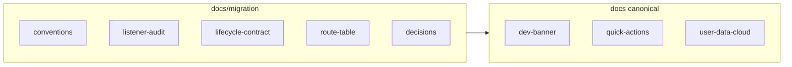

# Migration docs — conventions

**Start here.** This folder (`docs/migration/`) is the working set for the MPA → SPA path: audits, route tables, lifecycle contract, and ADR-style decisions. Product behavior (what the app does today) stays documented under sibling files in [`docs/`](../) and enforced in [`.cursor/rules/`](../../.cursor/rules/).

Parent plan: [`.cursor/plans/mpa_to_spa_path_9cf9cebf.plan.md`](../../.cursor/plans/mpa_to_spa_path_9cf9cebf.plan.md) (`docs-track` and follow-on todos).

---

## Single source of truth

| Concern | Where it lives |
|--------|----------------|
| Feature behavior (dev banner, quick actions, cloud, copy tone, SKP) | [`../dev-banner.md`](../dev-banner.md), [`../quick-actions.md`](../quick-actions.md), [`../user-data-cloud.md`](../user-data-cloud.md), [`../restore-copy-voice.md`](../restore-copy-voice.md), [`../semantic-keyword-palette.md`](../semantic-keyword-palette.md) + matching `.cursor/rules/*.mdc` |
| SPA migration path, listener gate, mount contract, route table, roll-out ADRs | This folder |

**Rule:** Link to canonical feature docs; do not copy long behavior specs into migration files unless a short excerpt is needed for a decision record.

When implementation changes behavior or keys, update the **feature doc** (and rules tables where applicable) first; add an optional one-line “See also” from that doc to a migration section only if it helps readers find SPA context.

---

## Files in this folder

| Doc | Owner todo (parent plan) |
|-----|---------------------------|
| [listener-audit.md](./listener-audit.md) | `utils-audit` — **gate** |
| [lifecycle-contract.md](./lifecycle-contract.md) | `first-lifecycle` — **contract** |
| [route-table.md](./route-table.md) | `route-table` |
| [decisions.md](./decisions.md) | `data-fetching-policy`, `rollout-lifecycles`, link/hash notes, etc. |

---

## Canonical references (nav, dev, quick actions, cloud)

These docs stay authoritative when migration touches shared nav, dev tooling, dashboard quick actions, or Supabase / preferences:

- [Dev banner and app-time](../dev-banner.md) — `.cursor/rules/dev-banner.mdc`
- [Quick actions](../quick-actions.md) — `.cursor/rules/quick-actions.mdc`
- [User data and cloud](../user-data-cloud.md) — `.cursor/rules/user-data-cloud.mdc`

For UI copy and color/event semantics during refactors, see also [restore copy voice](../restore-copy-voice.md) and [semantic keyword palette](../semantic-keyword-palette.md).

---

## Linking style

From any file in `docs/migration/`, use relative paths to other docs, e.g. `../dev-banner.md`, `../user-data-cloud.md`, and `./listener-audit.md` for peers in this folder.

---

## Doc relationships (optional)

Migration docs **reference** feature docs; they do not replace them.
