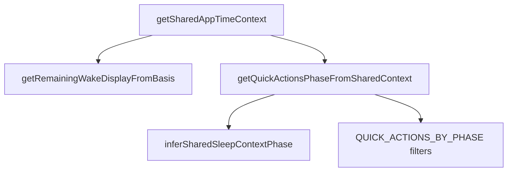
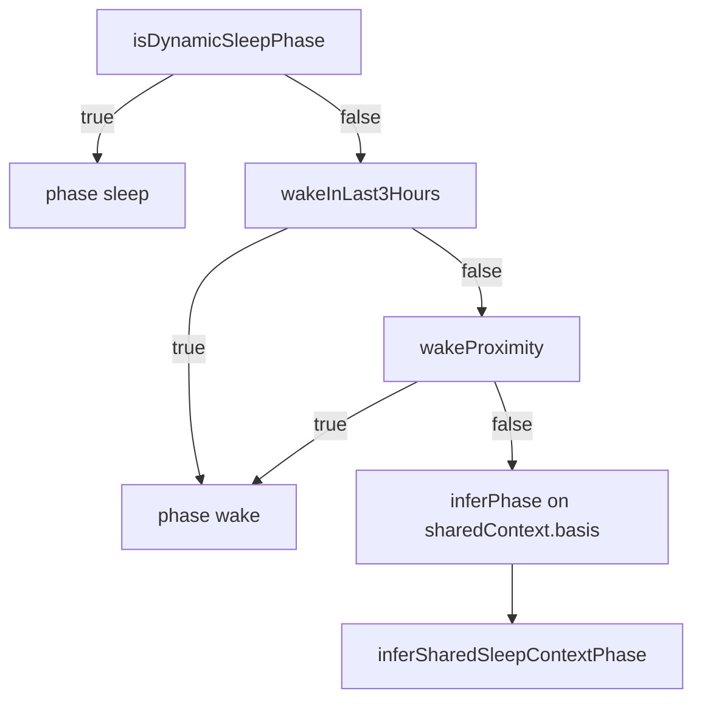

# Quick actions — phase and visibility logic

Reference for dashboard quick actions (wake / nap / sleep), remaining-wake alignment, and which sleep-period row each action writes to. Implementation lives in `sleep-utils.js` and `quick-actions.js`.

The quick-action system is best thought of as **four independent layers**. Resolving one layer does not imply the next; each step builds on the outputs of the previous ones.

---

## Architecture (data flow)

Shared app time context is computed once; the nav remaining-wake widget and quick-action phase both consume it. Quick-action **buttons** are then filtered by phase-specific rules.

---

## Layer 2 — Clock context (phase) order

When `getSharedAppTimeContext` succeeds, quick-action phase is resolved in this **strict order** (see `getQuickActionsPhaseFromSharedContext` in `quick-actions.js`):

If there is no shared context (or no `navDisplay`), phase falls back to `inferSharedSleepContextPhase` using **dashboard averages** from `getAveragesFromDays` / `calculateAverages` (recent up to 7 days).
**Canonical clock basis for phase** when shared context exists: `sharedContext.basis` from `getEffectiveRemainingWakeBasis` (recent seven days plus optional tonight projection adjustment). That can differ from the separate `averages` object used for alarm eligibility, which does not apply projection adjustment.

---

## Layer 1 — Session state (Dynamic Sleep precondition)

**Dynamic Sleep** (open sleep session in the nav / quick actions sense) is **not** the same as “phase = sleep” from `inferSharedSleepContextPhase` alone.

Dynamic Sleep is active when `shouldShowDynamicSleepNavPhase` is true:

- Wake is **not** finalized for the current sleep-period row (`nightMd`): no QA wake flag and `sleepEnd` still matches stub where applicable (`isNightWakeLogged` false).
- **Bed or fell-asleep** is considered logged for that row: QA flags and/or row differs from stub with plausible recent wall clock (`isNightBedOrSleepLogged`).
- Clock is in **overnight limbo** or the **evening sleep window** (see Layer 2 details below).
`getSharedAppTimeContext` exposes this as **`isDynamicSleepPhase`**. Dashboard quick actions use that flag (not string-matching on `navDisplay.phase`) as the first branch for forcing phase **`sleep`**.

---

## Layer 2 — Clock context (details)

### Dynamic Sleep

Active only when Layer 1’s session precondition holds **and** at least one of:

1. **Overnight limbo** — `shouldShowGoToBedSoonWakeNav`: clock is after average fell-asleep or before average get-up on a typical wake-before-sleep schedule (skipped when average wake ≥ average sleep on the clock).
2. **Evening sleep window** — `inferNavSleepWindowPhase` / `inferSharedSleepContextPhase`: clock within **120** minutes before through **240** minutes after average fell-asleep, using an offset normalized around the sleep average (`remainWakeOffsetFromSleepAvg`).

**Wake proximity:** Before the sleep window is evaluated, `inferSharedSleepContextPhase` checks **circular** distance to average get-up (`remainWakeCircDistMinutes`). If within **105** minutes, phase is **`wake`** instead of **`sleep`**.

**Important nuance:** That 105-minute rule applies **inside** the evening-window path. **Overnight limbo** does **not** re-check wake proximity. So Dynamic Sleep can still be active shortly before average wake if the session is open and limbo is true—even when `inferSharedSleepContextPhase` alone would return `wake`. Do not read “wake proximity overrides sleep” as canceling **limbo-based** Dynamic Sleep.

### After Dynamic Sleep is ruled out

- **Recent wake** — `wakeInLast3Hours`: a wake was logged in the last **3** hours (QA `wakeAtMs` and/or non-stub `sleepEnd` on today / yesterday / tomorrow wake-day candidates). Phase = **`wake`**.
- **Wake proximity** — `wakeProximity`: within **105** minutes of average get-up (circular). Phase = **`wake`**.
- **Fallback** — `inferSharedSleepContextPhase(now, basis.avgSleepStart, basis.avgSleepEnd)` → **`wake`**, **`sleep`**, or **`mid`** (105 min / 120 before / 240 after rules).

### Nav “go to bed soon” vs quick-action phase

The header can show the soft **go to bed soon** state (`getRemainingWakeDisplayFromBasis`) in overnight limbo **without** Dynamic Sleep—for example when bed/sleep are not logged yet. Quick actions **do not** map that nav label to phase **`sleep`**; they continue down the chain and may end in **`mid`**. So the nav can say “go to bed soon” while **mid** actions (e.g. start a nap) remain eligible.

---

## Layer 3 — Action eligibility

Once phase is **`wake`**, **`sleep`**, or **`mid`**, each button has its own predicate (`QUICK_ACTIONS_BY_PHASE` in `quick-actions.js`).

| Action        | Phase | Shown when |
|---------------|-------|------------|
| Wake up       | wake  | Always in wake phase |
| Log alarm     | wake  | Recent nights include computable first-alarm-to-wake data (`avgFirstAlarmToWake != null` from `calculateAverages` on up to 7 recent days) |
| Get in bed    | sleep | Bed not already logged for the sleep-period row (QA flag or non-stub `bed` within last **12** h wall-clock window) |
| Go to sleep   | sleep | Fell-asleep not already logged (same 12 h / stub / QA rules) |
| Sleep in 10 min | sleep | Neither fell-asleep logged nor **both** bed and fell-asleep complete for the row |
| Bathroom break | sleep | Both bed and fell-asleep recorded for the row (flags or stub-diff + 12 h) |
| Start a nap   | mid   | `navDisplay.percentRemaining >= openMin` (remaining-wake thresholds), **not** `wakeInLast3Hours`, **not** implicit post-wake quiet window, and **not** `napActive` |
| End your nap  | mid, wake, sleep | Calendar-day row for “today” (`date` = month/day of app now, e.g. afternoon 4/10 → `4/10`) has an open nap on loaded cloud data **or** in `sleep_day_drafts` for that `date_md`, or matching offline nap session. Shown in wake/sleep too whenever `napActive` so a phase change does not hide it. |

**Nap vs cloud drafts:** Quick saves use `promote_draft_if_complete`. Until bed, sleep start, and wake are all present on the draft, promotion does **not** copy the whole row into `sleep_days`, but nap patches still update the draft. The dashboard list is built from `sleep_days` only, so quick actions also consult `sleep_day_drafts` for the same ISO night key (`sleep_date` / row `date`) when deciding `napActive`. When a `sleep_days` row **already exists** for that night, the RPC copies `nap_start` / `nap_end` from the draft into `sleep_days` on each nap patch (see `supabase/schema.sql` and `supabase/migrations/20260410180000_sync_nap_from_draft_to_sleep_days.sql` — apply the migration on your Supabase project).

**Implicit post-wake quiet:** `implicitPostWakeQuiet` — wall clock within **180** minutes after average get-up on a typical schedule (`isImplicitPostWakeQuietWindow`). Suppresses **Start a nap** even in **`mid`** phase.

---

## Layer 4 — Save target row

Each action persists to the **sleep-period row keyed by wake day** (`date` on the row is the morning you wake into).
- **Late-night / evening** actions belong to **tomorrow’s** wake-day row when clock is past the early-morning band (see constants: `recordDateMdForSleepPeriod`).
- **Wake** and **alarm** use **`resolveRecordDateMdForWake`** when available: same primary key as above, but if the calendar morning advanced while **yesterday’s** wake-day row is still awaiting get-up, the correction targets that prior row so wake and bed/sleep do not split across rows.
- **Bed**, **fell-asleep**, and **bathroom** use **`recordDateMdForSleepPeriod`** only (no early-morning correction).
- **Nap start / end** use the **calendar day** of app `now` (same `date` as “today’s” row, e.g. a 4/10 afternoon nap → `4/10`), not the evening forward shift used for tonight’s bed row.

---

## Phase and row constants

Values match `sleep-utils.js` (and inline `120` where noted). Update this table when code changes.

| Identifier | Value | Meaning |
|------------|------:|---------|
| `PHASE_WAKE_PROXIMITY_MINS` | 105 | Circular minutes to average get-up; inside `inferSharedSleepContextPhase`, maps to **wake** before the sleep window is considered |
| `PHASE_SLEEP_WINDOW_BEFORE` | 120 | Minutes before average fell-asleep included in **sleep** phase window |
| `PHASE_SLEEP_WINDOW_AFTER` | 240 | Minutes after average fell-asleep included in **sleep** phase window |
| `IMPLICIT_POST_WAKE_QUIET_MINUTES` | 180 | After average get-up, suppress nap start (typical wake-before-sleep schedule only) |
| Early-morning band (inline) | 120 | Minutes after average get-up on the clock: still map to **today’s** wake-day row in `recordDateMdForSleepPeriod`; also defines “early morning” for `resolveRecordDateMdForWake` |
| Recent wall-clock window (QA / logged fields) | 12 | Hours back (plus small forward tolerance) for treating stub-differing `bed` / `sleepStart` / `sleepEnd` as “recently logged” |
| Recent wake window | 3 | Hours for `isRecentWakeInHours` / `wakeInLast3Hours` |

---

## Source map

| Concept | Primary location |
|--------|-------------------|
| Shared context, dynamic sleep, wake flags, quiet window | `getSharedAppTimeContext`, `shouldShowDynamicSleepNavPhase`, `isRecentWakeInHours`, `isImplicitPostWakeQuietWindow` — `sleep-utils.js` |
| Phase inference (105 / 120 / 240) | `inferSharedSleepContextPhase`, `isWithinWakeProximity` — `sleep-utils.js` |
| Nav display (including dynamic sleep UI) | `getRemainingWakeDisplayFromBasis` — `sleep-utils.js` |
| Quick-action phase order | `getQuickActionsPhaseFromSharedContext` — `quick-actions.js` |
| Button definitions | `QUICK_ACTIONS_BY_PHASE`, `renderQuickActions` — `quick-actions.js` |
| Wake-day key / wake correction | `recordDateMdForSleepPeriod`, `resolveRecordDateMdForWake`, `nightRowAwaitingWake` — `sleep-utils.js` |
| QA flags (bed / sleep / wake) | `readNightQaSleepFlagMap`, `markNightQaSleepFlag` — `sleep-utils.js` |
| Seven-day basis vs dashboard averages | `getEffectiveRemainingWakeBasis`, `computeRecentSevenDayWakeBasis` vs `getAveragesFromDays` / `calculateAverages` — `sleep-utils.js` / `quick-actions.js` / `daily.js` |

---

## Two averages pipelines (red flag to remember)

- **Phase / nav / nap threshold:** `sharedContext.basis` ← `getEffectiveRemainingWakeBasis` (recent 7 days + optional tonight projection adjustment).
- **Alarm quick action:** `averages.avgFirstAlarmToWake` from `getAveragesFromDays` → `calculateAverages` (recent 7 days, **no** projection adjustment).

If you add features, prefer **`basis`** for anything time-phase or row-key related unless you intentionally want dashboard-stat semantics.
