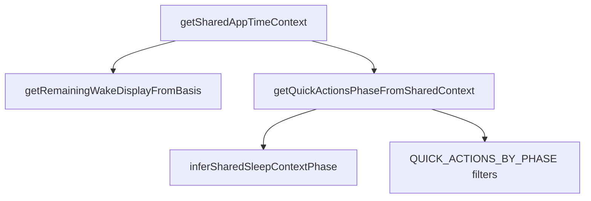
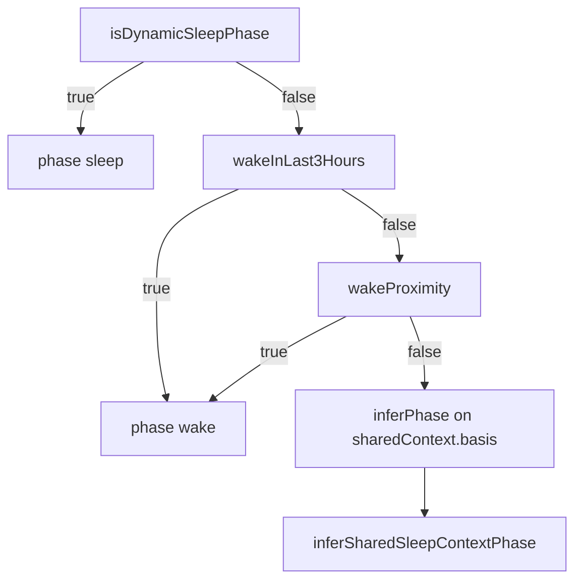

# Quick actions — phase and visibility logic

Reference for dashboard quick actions (wake / nap / sleep): which phase they resolve to, which buttons show, and which night row each action writes to. Implementation lives in `src/lib/sleep-utils.js` and `src/routes/quick-actions.js`. The nav display these phases line up with (Dynamic Sleep, *waking soon*, *start sleep soon*, *get in bed soon*) is specified in [remaining-wake.md](remaining-wake.md).

The quick-action system is four independent layers. Resolving one layer does not imply the next; each builds on the outputs of the previous ones:

1. **Session state** — is a night open (bed or fell-asleep logged, no wake)?
2. **Clock context** — which phase (`wake` / `sleep` / `mid`) quick actions use.
3. **Action eligibility** — which buttons show in that phase.
4. **Save target row** — which night a tap writes to.

---

## Architecture (data flow)

Shared app time context is computed once; the nav remaining-wake widget and quick-action phase both consume it. Quick-action **buttons** are then filtered by phase-specific rules.

```mermaid
flowchart TD
  ctx[getSharedAppTimeContext]
  nav[getRemainingWakeDisplayFromBasis]
  qaPhase[getQuickActionsPhaseFromSharedContext]
  infer[inferSharedSleepContextPhase]
  buttons[QUICK_ACTIONS_BY_PHASE filters]
  ctx --> nav
  ctx --> qaPhase
  qaPhase --> infer
  qaPhase --> buttons
```

---

## Layer 1 — Session state

The session part of **Dynamic Sleep** ([remaining-wake.md § Dynamic Sleep](remaining-wake.md#dynamic-sleep)): for the night key (`nightKey`), wake is not logged (`isNightWakeLogged` false) and bed or fell-asleep is logged (`isNightBedOrSleepLogged`).

Dynamic Sleep is **not** the same as "phase = sleep" from `inferSharedSleepContextPhase` alone: it also needs the clock condition in Layer 2. `getSharedAppTimeContext` exposes the combined result as **`isDynamicSleepPhase`**, and quick actions branch on that flag, not on `navDisplay.phase` strings.

---

## Layer 2 — Clock context (phase)

When `getSharedAppTimeContext` succeeds, quick-action phase is resolved in this **strict order** (`getQuickActionsPhaseFromSharedContext` in `quick-actions.js`):

```mermaid
flowchart TD
  d[isDynamicSleepPhase]
  w3[wakeInLast3Hours]
  wp[wakeProximity]
  fb[inferPhase on sharedContext.basis]
  d -->|true| sleepPh[phase sleep]
  d -->|false| w3
  w3 -->|true| wakePh[phase wake]
  w3 -->|false| wp
  wp -->|true| wakePh
  wp -->|false| fb
  fb --> out[inferSharedSleepContextPhase]
```

1. **Dynamic Sleep** — `isDynamicSleepPhase`: Layer 1 holds **and** the clock is in overnight limbo or the evening sleep window (both defined in [remaining-wake.md § Dynamic Sleep](remaining-wake.md#dynamic-sleep)). Phase = **`sleep`**.
2. **Recent wake** — `wakeInLast3Hours`: a wake was logged in the last **3** hours (QA `wakeAtMs` and/or non-stub `sleepEnd` on today / yesterday / tomorrow wake-day candidates). Phase = **`wake`**.
3. **Wake proximity** — `wakeProximity`: within **105** minutes of basis get-up (circular). Phase = **`wake`**.
4. **Remaining-wake alignment** (below), else **fallback** — `inferSharedSleepContextPhase(now, basis.avgSleepStart, basis.avgSleepEnd)` → **`wake`**, **`sleep`**, or **`mid`** (105 / 120 before / 240 after rules).

**Clock basis.** With shared context, phase uses `sharedContext.basis` from `getEffectiveRemainingWakeBasis` / `getTonightWakePhaseBasisFromDays` (recent averages, optional saved Tonight target from `user_settings`, then optional session slider). That can differ from the separate `averages` object used for the alarm gate (Layer 3), which has none of those overlays. Without shared context (or without `navDisplay`), phase falls back to `inferSharedSleepContextPhase` on plain recent averages (`getAveragesFromDays` → `computeRecentAverages`).

**Wake proximity inside Dynamic Sleep.** `inferSharedSleepContextPhase` checks the 105-minute wake proximity before its sleep window, so the evening-window path into Dynamic Sleep can't fire near wake. **Overnight limbo** doesn't re-check it, so Dynamic Sleep (and phase `sleep`) can stay active shortly before basis wake while a night is open, even when `inferSharedSleepContextPhase` alone would return `wake`. Don't read "wake proximity overrides sleep" as cancelling limbo-based Dynamic Sleep.

**Nav labels inside Dynamic Sleep.** *Waking soon* and *start sleep soon* are display-only: `isDynamicSleepPhase` stays true, so the sleep-phase button set stays.

### Remaining-wake alignment

The header can show *get in bed soon* in overnight limbo **without** Dynamic Sleep, for example when bed and sleep aren't logged yet. Quick actions still apply recent wake and wake proximity first. After those, if the nav display is normal **presleep** (`phase === 'presleep'`), **`sleepSoon`**, or a soft *get in bed soon* / *start sleep soon* label, quick actions use phase **`sleep`**, so bedtime actions stay available even outside the −120 / +240 minute window around basis sleep. Otherwise inference falls through to **`mid`** or **`wake`** (e.g. open / winding nav with **Start a nap** when allowed).

---

## Layer 3 — Action eligibility

Once phase is **`wake`**, **`sleep`**, or **`mid`**, each button has its own predicate (`QUICK_ACTIONS_BY_PHASE` in `quick-actions.js`).

| Action        | Phase | Shown when |
|---------------|-------|------------|
| Wake up       | all   | **Any phase** while a night is open (`getOpenNight`: bed or fell-asleep on the newest draft, no wake, not abandoned — see [wake-day-key.md § Open night](wake-day-key.md)). In **wake** phase also shown with no open night while wake is not yet logged for the save target row (`wakeLoggedForNightKey`). When more than `WAKE_LATE_NOTE_MINUTES` past the natural wake on the open night's wake date, the button carries a short note: *Woke earlier? You can fix the time in Log.* Save target: the open night, else `resolveFallbackWakeNightKey` on the natural wake (`resolveWakeNightKey`). |
| Log alarm     | wake  | The recent average has at least one alarm night (`averages.avgWakeLag != null`, from `getAveragesFromDays`), **and** the wake-day row (plus cloud draft for that key) has no alarm times and has not been dismissed with the in-memory **No alarm was set** action for the current wake-day key. **Does not** persist from the dashboard: stores `restore_log_prefill_v1` in `sessionStorage`, navigates to Log (`internalNavHref('tab.log')`); Log loads that wake-day row and **appends** an alarm row set to **app now** so the form is dirty until the user saves. |
| No alarm was set | wake  | Same gates as Log alarm. Dismisses both alarm quick actions in memory for the current wake row only (`resolveWakeNightKey`: the open night, else the cutover row); no sleep row, draft, or night note is written, so the prompt can reappear after the wake-day key changes or the module is reloaded. |
| Get in bed    | sleep | Bed not already logged for the sleep-period row (QA flag, non-stub `bed` within last **12** h wall-clock window, or `bed` on tonight's open-night draft) |
| Go to sleep   | sleep | Fell-asleep not already logged (same 12 h / stub / QA rules, or `sleepStart` on tonight's open-night draft) |
| Sleep in 10 min | sleep | Neither fell-asleep logged nor **both** bed and fell-asleep complete for the row |
| Bathroom break | sleep | Both bed and fell-asleep recorded for the row (flags or stub-diff + 12 h) |
| Start a nap   | mid   | `navDisplay.percentRemaining >= openMin` (remaining-wake thresholds), **not** `wakeInLast3Hours`, **not** implicit post-wake quiet window, and **not** `napActive` |
| End your nap  | mid, wake, sleep | Calendar-day row for “today” (`date` = app now's calendar date, e.g. an afternoon nap on 2026-04-10 → `2026-04-10`) has an open nap on loaded cloud data **or** in `sleep_day_drafts` for that night’s ISO `sleep_date`, or matching offline nap session. Shown in wake/sleep too whenever `napActive` so a phase change does not hide it. |

**Nap vs cloud drafts:** Quick saves use `promote_draft_if_complete`. Until bed, sleep start, and wake are all present on the draft, promotion does **not** copy the whole row into `sleep_days`, but nap patches still update the draft. The dashboard list is built from `sleep_days` only, so quick actions also consult `sleep_day_drafts` for the same ISO night key (`sleep_date` / row `date`) when deciding `napActive`. When a `sleep_days` row **already exists** for that night, the RPC copies `nap_start` / `nap_end` from the draft into `sleep_days` on each nap patch (`promote_draft_if_complete` in `supabase/schema.sql`).

**Implicit post-wake quiet:** `implicitPostWakeQuiet` — wall clock within **180** minutes after average get-up on a typical schedule (`isImplicitPostWakeQuietWindow`). Suppresses **Start a nap** even in **`mid`** phase.

---

## Layer 4 — Save target row

Each action persists to the **sleep-period row keyed by wake day** (`date` on the row is the morning you wake into). Full rules: [wake-day-key.md](wake-day-key.md).
- **Bed** and **fell-asleep** start or continue a night: **`getCurrentNightKey`** — the cutover (`nightKeyForSleepPeriod`) on the **natural** recent-average wake.
- **Wake** and **alarm** (Log alarm, No alarm was set) close a night: **`resolveWakeNightKey`** — the **open night** when there is one, so a late wake never splits the night; otherwise `resolveFallbackWakeNightKey` (cutover + early-morning correction) on the natural wake.
- **Bathroom** is an in-night event: the open night when there is one, else `getCurrentNightKey`.
- **Nap start / end** use the **calendar day** of app `now` (e.g. an afternoon nap on 2026-04-10 → `2026-04-10`), not the evening forward shift used for tonight’s bed row.

---

## Phase and row constants

Values match `sleep-utils.js` (and inline `120` where noted). Update this table when code changes.

| Identifier | Value | Meaning |
|------------|------:|---------|
| `PHASE_WAKE_PROXIMITY_MINS` | 105 | Circular minutes to average get-up; inside `inferSharedSleepContextPhase`, maps to **wake** before the sleep window is considered |
| `PHASE_SLEEP_WINDOW_BEFORE` | 120 | Minutes before average fell-asleep included in **sleep** phase window |
| `PHASE_SLEEP_WINDOW_AFTER` | 240 | Minutes after average fell-asleep included in **sleep** phase window |
| `WAKING_SOON_NAV_MINS` | 60 | Minutes before basis get-up when the Dynamic Sleep nav label switches from **sweet dreams** to **waking soon** |
| `IMPLICIT_POST_WAKE_QUIET_MINUTES` | 180 | After average get-up, suppress nap start (typical wake-before-sleep schedule only) |
| Early-morning band (inline) | 120 | Minutes after the **natural** wake on the clock: still map to **today’s** wake-day row in `nightKeyForSleepPeriod`; also defines “early morning” for `resolveFallbackWakeNightKey` |
| `OPEN_NIGHT_MAX_AGE_HOURS` | 24 | Hours after an open night's fell-asleep (bed if missing) before it is abandoned |
| `WAKE_LATE_NOTE_MINUTES` | 180 | Minutes past the natural wake (on the open night's wake date) before Wake up shows its "woke earlier?" note |
| `OPEN_NIGHT_DRAFT_LOOKBACK` | 5 | Newest drafts fetched to resolve the open night |
| Recent wall-clock window (QA / logged fields) | 12 | Hours back (plus small forward tolerance) for treating stub-differing `bed` / `sleepStart` / `sleepEnd` as “recently logged” |
| Recent wake window | 3 | Hours for `isRecentWakeInHours` / `wakeInLast3Hours` |

---

## Source map

| Concept | Primary location |
|--------|-------------------|
| Shared context, dynamic sleep, wake flags, quiet window | `getSharedAppTimeContext`, `shouldShowDynamicSleepNavPhase`, `isRecentWakeInHours`, `isImplicitPostWakeQuietWindow` — `sleep-utils.js` |
| Phase inference (105 / 120 / 240) | `inferSharedSleepContextPhase`, `isWithinWakeProximity` — `sleep-utils.js` |
| Nav display (including dynamic sleep UI) | `getRemainingWakeDisplayFromBasis` — `sleep-utils.js` |
| Quick-action phase order | `getQuickActionsPhaseFromSharedContext` — `quick-actions.js` |
| Button definitions | `QUICK_ACTIONS_BY_PHASE`, `renderQuickActions` — `quick-actions.js` |
| Night key / wake correction | `getNightKeyWakeMinutes`, `getCurrentNightKey`, `nightKeyForSleepPeriod`, `resolveFallbackWakeNightKey`, `nightRowAwaitingWake` — `sleep-utils.js` |
| Open night | `resolveOpenNight` (pure), `getOpenNight`, `fetchRecentNightDrafts`, `resolveWakeNightKey`, `minutesPastNaturalWake` — `sleep-utils.js` |
| Scenario tests | `tests/quick-actions-scenarios.mjs` (`npm run test:qa`) |
| QA flags (bed / sleep / wake) | `readNightQaSleepFlagMap`, `markNightQaSleepFlag` — `sleep-utils.js` |
| Recent-average basis vs plain recent averages | `getTonightWakePhaseBasisFromDays`, `computeRecentWakeBasis` vs `getAveragesFromDays` — all read `computeRecentAverages` in `sleep-utils.js` |
| Wake logged (quick actions) | `wakeLoggedForNightKey` — `sleep-utils.js` |
| Log alarm prefill | `restore_log_prefill_v1`, `tryConsumeLogAlarmPrefill`, `appendListTimeNow('quick-add-alarm-list')` — `quick-actions.js` / `entry-modal.js` |

---

## Natural vs scheduled times (red flag to remember)

- **Schedule timing** — phase, nav, countdowns, nap threshold: `sharedContext.basis` ← `getEffectiveRemainingWakeBasis` (recent averages + optional saved Tonight target / guidance + optional session slider adjustment).
- **Night key** — which row a save or lookup targets: always the **natural** wake (`getNightKeyWakeMinutes` / `getCurrentNightKey`), never `basis`, so dragging a slider or setting a target cannot change which night a tap lands on.
- **Alarm quick action gate:** `averages.avgWakeLag` from `getAveragesFromDays` → `computeRecentAverages`.
