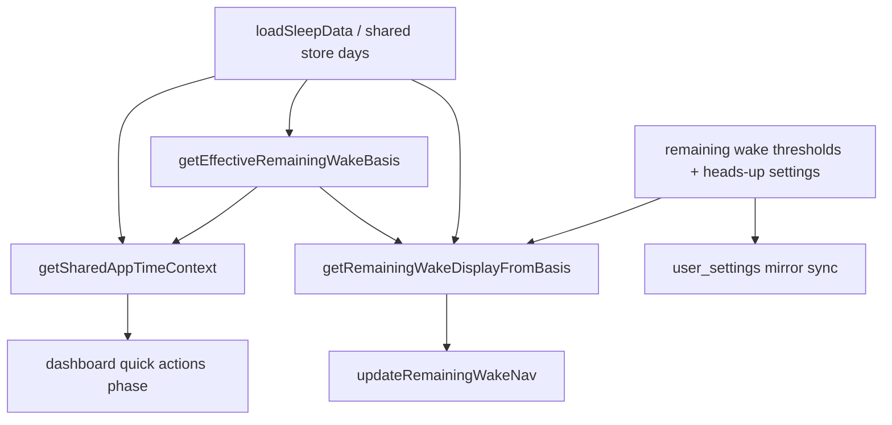

# Remaining wake feature reference

Reference for the remaining-wake implementation (product UI label is often **Remaining time** / legacy **Remaining wake time**) across nav, dashboard behavior, settings/about controls, and cloud sync. This is the master source for current behavior and upcoming work.

Implementation lives mainly in `src/lib/sleep-utils.js`, with route integration in `src/spa-app.js`, `src/routes/dashboard.js`, `src/routes/log.js`, `src/routes/settings.js`, and `src/routes/about.js`.

---

## Scope and terminology

- **Feature name (product):** Remaining time (see backlog item 1 for naming scope).
- **Implementation name:** Remaining wake / remaining-wake (selectors, helpers, storage keys, docs, i18n namespaces).
- **Primary UI surface:** Nav chip in the top header (`#nav-remaining-wake`) showing icon, label, optional heads-up, and progress bar.
- **Secondary surfaces:** Threshold controls in Settings and About pages via `getRemainingWakeThresholdsControlHTML(...)`.

---

## Architecture (data flow)

Core split:

1. **Time basis selection** (`getEffectiveRemainingWakeBasis`).
2. **Display computation** (`getRemainingWakeDisplayFromBasis`).
3. **UI render + classes** (`updateRemainingWakeNav`).
4. **Preferences + sync** (`get/setRemainingWakeThresholds`, `get/setRemainingWakePhaseHeadsUpMinutes`, `syncUserSettingsRowToCloud`).

---

## Basis selection (what clock model remaining wake uses)

Canonical basis comes from `getTonightWakePhaseBasisFromDays(days)`:

1. Recent seven-day averages (`computeRecentSevenDayWakeBasis`).
2. Optional saved Tonight target window (`getTonightTargetWindow`).
3. Optional session projection adjustment (`getTonightProjectionAdjustment`).

Returned basis:

- `avgSleepStart`
- `avgSleepEnd`
- `totalWakeMins` (duration from average wake to average sleep)

Fallback behavior:

- If seven-day basis is unavailable, `getFallbackWakeBasis()` is used.

---

## Phase model and display outputs

Remaining wake nav uses four display phases:

- `open` (sun icon)
- `winding` (sunset icon)
- `presleep` (bed icon)
- `sleep` (moon icon; dynamic override)

### Percent-threshold phases (`open` / `winding` / `presleep`)

`getRemainingWakePhase(remainingMins, totalWakeMins)` computes percent remaining:

- `percentRemaining >= openMin` -> `open`
- `percentRemaining >= windingMin` -> `winding`
- else -> `presleep`

Defaults:

- `openMin = 35`
- `windingMin = 15`

Threshold invariants:

- Stored values are clamped to integer percent.
- `openMin > windingMin` is required.

### Dynamic sleep override (`sleep`)

Before normal remaining-minute math, `getRemainingWakeDisplayFromBasis(...)` checks:

- `shouldShowDynamicSleepNavPhase(days, basis, now, nightMd)`

If true, display returns:

- `phase: "sleep"`
- `timeLabel: "sweet dreams"`
- `timeLabelSoft: true`
- `percentRemaining: null`

#### Bed / fell-asleep considered “logged” for Dynamic Sleep (nav)

Dynamic Sleep uses `isNightBedOrSleepLogged`, built on **`isNightBedOrSleepLoggedCore`**:

- QA flags (`readNightQaSleepFlagMap`) for bed or sleep on that wake-day row, **or**
- The loaded day row differs from the **stub** built by `buildStubDayForNightMd` for bed or `sleepStart` (same idea as `nightRowAwaitingWake`).

Nav does **not** require wall-clock recency here: backfilled or older entries still count so the nav does not stay stuck on **get in bed soon** when the row is genuinely filled in.

**Evening wake-day alignment:** After local evening, `recordDateMdForSleepPeriod(now, avgWake)` uses **tomorrow’s** ISO wake-day key (`nightMd`), while the user may still have saved bed/sleep on **today’s** row. When `nightMd` equals **tomorrow** (calendar), `isNightBedOrSleepLogged` also treats **today’s** row as logged if core checks pass there **and** `nightRowAwaitingWake(today)` — i.e. today’s wake-day row is still an open night (morning wake not finalized). A **completed** prior row must not satisfy “logged” for the upcoming sleep period.

**Quick actions are separate:** Dashboard buttons still use stub diff **plus** a **12-hour** wall-clock window where applicable (`docs/quick-actions.md`). Only remaining-wake Dynamic Sleep uses the relaxed nav rules above.

### "Get in bed soon" / "Start sleep soon" soft states

See **`docs/remaining-time.md`** for the full split (including Dynamic Sleep vs soft labels). In short: overnight limbo uses **`get in bed soon`** when bed is not logged yet, and **`start sleep soon`** after bed is logged but fell-asleep / sleep intent is not.

If `shouldShowGoToBedSoonWakeNav(...)` is true and wake has not been logged for the current sleep period row, **and** Dynamic Sleep is not active (bed/sleep not treated as logged per the previous section):

- phase is derived from `getRemainingWakePhase(0, totalWakeMins)` (typically `presleep`)
- label is `"get in bed soon"` (or `"start sleep soon"` when the bed-logged rule from remaining-time applies)
- `timeLabelSoft: true`
- `percentRemaining: 0`

### Normal remaining-wake state

Otherwise:

- Remaining minutes are computed to average sleep start.
- Label is `formatDuration(remainingMins)`.
- `percentRemaining` drives the progress bar.
- Optional heads-up comes from `computeRemainingWakePhaseHeadsUp(...)`.

---

## Default Log / quick-add wake-day key

`resolveDefaultQuickAddNightDateMd(days)` chooses an incomplete draft first if any, otherwise **`recordDateMdForSleepPeriod(getAppDate(), basis.avgSleepEnd)`** from `getEffectiveRemainingWakeBasis`. It does **not** add an extra calendar day based on nav phase (that previously could advance the default two days ahead in the evening).

---

## Heads-up behavior

Heads-up settings:

- Key: `sleep-app-remaining-wake-phase-heads-up-mins`
- Allowed values: `0, 15, 30, 45, 60`
- Default: `30`

Display behavior:

- Only shown in `open` and `winding` phases.
- Shows next phase icon + minutes (for example, "🌇 in 24m").
- No heads-up shown in `presleep` or `sleep`.

Wrapper visual blending:

- `updateRemainingWakeNav(...)` toggles `nav-wrapper--rw-heads-up-blend`.
- Uses CSS variable `--nav-header-mid` based on remaining heads-up proportion.

---

## UI integration by route

`src/spa-app.js` route config includes `remainingWake` control:

- Dashboard + Log call `initRemainingWakeNav({ interval: false })` because those pages refresh nav with their own page data/timers.
- Other routes call `initRemainingWakeNav()` with built-in 60s refresh interval.

Route specifics:

- **Dashboard:** updates nav after dashboard render and after Tonight adjuster changes.
- **Log:** updates nav from page data and runs its own 60s interval.
- **Settings/About:** mount threshold controls and initialize threshold config wiring.

---

## Persistence and cloud sync

Local storage:

- Thresholds: `sleep-app-remaining-wake-thresholds` JSON `{ openMin, windingMin }`
- Heads-up: `sleep-app-remaining-wake-phase-heads-up-mins`

Cloud mirror columns (`user_settings`):

- `remaining_wake_open_min`
- `remaining_wake_winding_min`
- `remaining_wake_phase_heads_up_mins`

Write path:

- Setters write local first, then call `syncUserSettingsRowToCloud()` (when cloud gate is on).

Read/hydrate path:

- `ensureUserSettingsFromCloud` maps DB row back to local storage via `userSettingsRowToLocalStorage`.

---

## Accessibility and links

- Nav chip is rendered as a link to Settings Remaining wake time (`settings.remainingWake` route key); About `#remaining-wake-time` stays the narrative deep link from Settings.
- ARIA label changes by state (remaining time, sleep, get-in-bed-soon / start-sleep-soon, heads-up announcement).
- Settings controls provide ARIA labels on sliders and heads-up selectors.

---

## Styling notes

- Remaining wake nav and controls are styled in `src/styles/styles.css` (`.nav-remaining-wake-*`, `.config-remaining-wake-*`).
- Sleep-domain colors should follow SKP tokens from `docs/semantic-keyword-palette.md` (`--color-sleep`, `--color-bed`, `--color-up`, etc.) for any future phase visuals.

---

## Source map (quick index)

| Concept | Primary symbols |
|--------|------------------|
| Threshold storage + defaults | `REMAINING_WAKE_THRESHOLDS_KEY`, `DEFAULT_REMAINING_WAKE_OPEN_MIN`, `DEFAULT_REMAINING_WAKE_WINDING_MIN`, `getRemainingWakeThresholds`, `setRemainingWakeThresholds` |
| Heads-up storage + conversion | `REMAINING_WAKE_PHASE_HEADS_UP_KEY`, `REMAINING_WAKE_PHASE_HEADS_UP_ALLOWED`, `getRemainingWakePhaseHeadsUpMinutes`, `setRemainingWakePhaseHeadsUpMinutes`, slider conversion helpers |
| Basis selection | `computeRecentSevenDayWakeBasis`, `getTonightWakePhaseBasisFromDays`, `getEffectiveRemainingWakeBasis`, `getFallbackWakeBasis` |
| Phase/time inference | `getRemainingWakePhase`, `computeRemainingWakePhaseHeadsUp`, `shouldShowGoToBedSoonWakeNav` |
| Dynamic sleep logic | `shouldShowDynamicSleepNavPhase`, `isNightBedOrSleepLogged`, `isNightBedOrSleepLoggedCore`, `isNightWakeLogged`, `inferNavSleepWindowPhase` |
| Display object | `getRemainingWakeDisplayFromBasis`, `getRemainingWakeDisplayFromDays` |
| Nav render | `updateRemainingWakeNav`, wrapper phase classes, heads-up blend class |
| Lifecycle/init | `initRemainingWakeNav`, route config `remainingWake` in `src/spa-app.js` |
| Default log date | `resolveDefaultQuickAddNightDateMd`, `recordDateMdForSleepPeriod` |

---

## Work remaining (backlog for next implementation passes)

### 1) Naming and product-language alignment

Current code/docs mostly say "Remaining wake time" while product direction is "Remaining time".

- Decide canonical naming scope (UI-only rename vs helper/storage/doc rename too).
- If renaming keys/symbols, define compatibility strategy for localStorage and cloud column names.
- Update route hashes/anchors only if backwards links are preserved.

### 2) i18n completion for nav runtime strings

Some nav labels are still hard-coded English in display/render paths (for example `sweet dreams`, `get in bed soon`, `start sleep soon`, and heads-up text formatting).

- Move remaining hard-coded nav strings to translation keys.
- Confirm ARIA text and visible text both localize correctly.

### 3) Single-source refresh model

Remaining wake updates currently come from mixed paths (global init interval + page-level updates/timers).

- Decide one canonical refresh ownership model (shared store subscription vs per-route timers).
- Remove duplicate timing logic once ownership is consolidated.

### 4) Live basis freshness guarantees

`initRemainingWakeNav` computes `basis`/`days` once, then interval refresh uses those captured values.

- Confirm expected behavior when data/settings change without remount.
- If stale behavior is undesired, recalc basis from fresh store snapshot each tick (or subscribe to store changes).

### 5) Test coverage around phase boundaries

Behavior depends on minute/percent thresholds and dynamic sleep overrides.

- Add deterministic tests around 35/15 defaults, custom thresholds, and 0/15/30/45/60 heads-up settings.
- Add boundary tests around wake proximity and sleep-window transitions via shared context helpers.

### 6) Documentation convergence

Remaining-wake behavior is split across multiple docs (`quick-actions`, `user-data-cloud`, settings/about copy).

- Keep `docs/remaining-wake.md` as canonical and cross-link from related docs.
- When phase constants or thresholds change, update this doc in the same PR.

---

## Change checklist (for future PRs touching this feature)

- Update `docs/remaining-wake.md` with behavior changes.
- Verify Settings and About threshold controls stay in sync.
- Verify nav ARIA + visible labels in both themes.
- Verify cloud/local persistence paths for thresholds and heads-up.
- Verify quick-actions alignment when phase logic changes.
